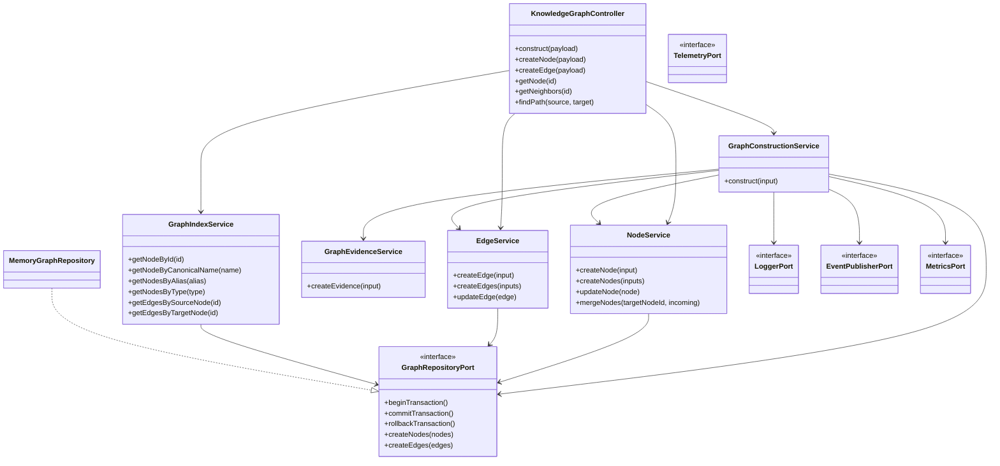
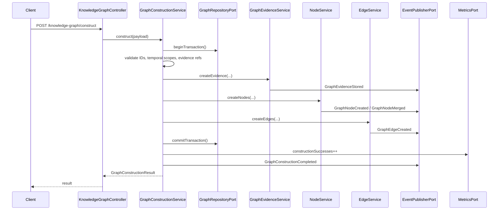
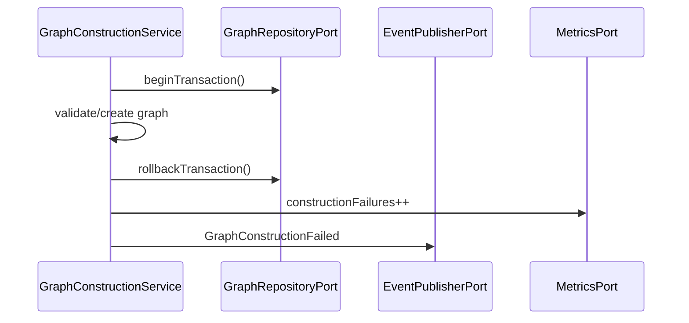

# DKE-016 Knowledge Graph Construction

DecisionOS DKE-016 converts validated and fused knowledge into graph nodes, graph relationships, evidence records, temporal edges, and queryable graph structures.

This module only constructs and stores the knowledge graph. It does not implement reasoning, recommendation, simulation, prediction, autonomous decision-making, LLM calls, or DKE-017 behavior.

## Architecture Overview

DKE-016 uses Clean Architecture with Ports & Adapters:

- `domain`: graph models and typed errors
- `ports`: repository, entity resolution, embedding, ontology, logger, events, metrics, and evidence interfaces
- `services`: business logic for validation, confidence, entity resolution, node/edge/evidence operations, indexing, and construction
- `adapters`: replaceable infrastructure implementations
- `api`: thin controller and route definitions with no business logic
- `composition`: module factory that wires the full module from one exported function

No core service depends on Neo4j, Pinecone, OpenAI, Supabase, or any other provider.

## UML Class Diagram



## Graph Construction Sequence



Failure path:



## Composition Root Usage

```ts
import { createKnowledgeGraphModule } from "@decisionos/dke-016-knowledge-graph";

const dke016 = createKnowledgeGraphModule();

await dke016.controller.construct({
  nodes: [
    {
      id: "node_acme",
      type: "organization",
      canonicalName: "Acme Corp",
      aliases: ["Acme"],
      attributes: { industry: "Manufacturing" },
      confidence: 0.96,
      sourceIds: ["source_board_minutes"],
    },
  ],
  edges: [],
  evidence: [],
});
```

The factory wires:

- `MemoryGraphRepository`
- `ConsoleLoggerAdapter`
- `InMemoryEventPublisherAdapter`
- `InMemoryMetricsAdapter`
- all services
- `KnowledgeGraphController`

Custom adapters can be injected:

```ts
const dke016 = createKnowledgeGraphModule({
  graphRepository: myRepository,
  logger: myLogger,
  eventPublisher: myEventPublisher,
  metrics: myMetrics,
  telemetry: myTelemetry,
});
```

## Memory Repository Usage

`MemoryGraphRepository` fully supports:

- nodes, edges, and evidence
- lookup by ID, canonical name, alias, and node type
- neighbor lookup
- path lookup
- batch create/update/delete operations
- transaction snapshots with rollback

## Benchmarking Large Imports

The benchmark script imports synthetic graphs through the public composition root and controller, so it measures the same construction path used by applications.

```bash
npm install
npm run benchmark
```

Defaults:

- `DKE_BENCH_NODES=100000`
- `DKE_BENCH_EDGE_FANOUT=1`
- `DKE_BENCH_BATCH_SIZE=10000`

Examples:

```bash
DKE_BENCH_NODES=100000 npm run benchmark
DKE_BENCH_NODES=1000000 DKE_BENCH_BATCH_SIZE=50000 npm run benchmark
```

On PowerShell:

```powershell
$env:DKE_BENCH_NODES="1000000"
$env:DKE_BENCH_BATCH_SIZE="50000"
npm run benchmark
```

The benchmark prints JSON progress records with imported node count, elapsed seconds, nodes per second, and module metrics.

## Observability

The module includes `TelemetryPort` and `NoopTelemetryAdapter` as an optional observability seam. A later OpenTelemetry adapter can implement this port without introducing OpenTelemetry as a hard dependency or changing domain/service boundaries.

## Transaction Behavior

`GraphConstructionService.construct()` wraps construction in a repository transaction:

1. `beginTransaction()`
2. validate IDs, temporal scope, and evidence references
3. store evidence
4. create or merge nodes
5. create edges
6. `commitTransaction()` on success
7. `rollbackTransaction()` and publish failure event on failure

The memory adapter uses an in-memory snapshot for rollback.

## Events Emitted

- `GraphNodeCreated`
- `GraphNodeUpdated`
- `GraphNodeMerged`
- `GraphEdgeCreated`
- `GraphEvidenceStored`
- `GraphConstructionCompleted`
- `GraphConstructionFailed`

Events include `id`, `type`, `payload`, `createdAt`, and optional `correlationId`.

## Metrics Tracked

- `nodesCreated`
- `nodesUpdated`
- `edgesCreated`
- `evidenceStored`
- `duplicatesMerged`
- `validationFailures`
- `constructionFailures`
- `constructionSuccesses`
- `averageNodeConfidence`
- `averageEdgeConfidence`

## Example Construct Payload

See [examples/input-payload.json](examples/input-payload.json).

## Example Query Calls

```ts
const node = await dke016.services.index.getNodeById("node_acme");
const byName = await dke016.services.index.getNodeByCanonicalName("Acme Corp");
const byAlias = await dke016.services.index.getNodesByAlias("Acme");
const byType = await dke016.services.index.getNodesByType("organization");
const neighbors = await dke016.controller.getNeighbors("node_acme");
const path = await dke016.controller.findPath("node_acme", "node_expansion");
```

## Replace Memory With Neo4j Later

`Neo4jGraphRepository` exists only as a placeholder. To replace memory storage later:

1. Implement `GraphRepositoryPort` and `EvidenceRepositoryPort` in `adapters/Neo4jGraphRepository.ts`.
2. Keep SDK imports inside the adapter only.
3. Map `GraphNode`, `GraphEdge`, and `GraphEvidence` to provider records in the adapter.
4. Inject the adapter through `createKnowledgeGraphModule({ graphRepository })`.
5. Do not change domain, ports, services, or controller business boundaries.

## Run

```bash
npm install
npm test
```
